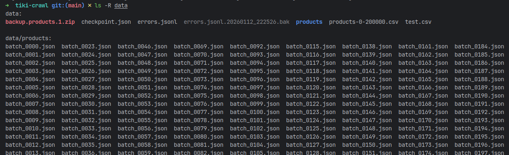

# Tiki Product Crawler

An asynchronous Python crawler designed to ingest product data from Tiki.vn.


## Key Features
* **Asynchronous arrchitecture:** Built with `aiohttp` and `asyncio` to handle high concurrency and maximize throughput.
* **Fault tolerance:** Implements automatic checkpointing. If the process is interrupted, it resumes from the last successful batch.
* **Error log retry mechanism:**
    * Logs failed requests (404, 500, Timeout) .
    * `--retry-error` mode to re-process only failed IDs with automatic log rotation.
* **Data validation:** Strict schema validation using **Pydantic** to ensure data quality.
* **Configurable:** Fully customizable via environment variables (concurrency, timeouts, batch sizes).

### Example output data
Run completed log:
```txt
============================================================
✅ COMPLETED!
============================================================
Products saved: 198942
Errors: 1058
Time: 63.07 minutes
Speed: 52.86 products/second
============================================================
```


> **Sample products file:** https://gist.github.com/plat102/cc9a3d2f31401a69fd4ff5f30f301bb6

## Set up
### Prerequisites

* **Python:** >= 3.12
* **Poetry:** For dependency management.
### Installation
1.  **Clone the repository:**
    ```bash
    git clone https://github.com/plat102/ingest-tiki-crawler
    cd ingest-tiki-crawler
    ```

2.  **Install dependencies:**
    ```bash
    poetry install
    ```

3.  **Setup env config:**
    ```bash
    cp .env.example .env
    ```

## Usage

### 1. Normal crawl
Reads product IDs from the input CSV and crawls data.
```bash
poetry run python src/main.py
```
* Input: data/default .csv (Default, configurable in .env).
* Output: data/products/batch_xxxx.json.
* Checkpoint: Saved to data/checkpoint.json.

Example: 


### 2. Retry errors
Reads the error log, backups the old log file, and retries only the failed IDs. This mode ignores the current checkpoint.
```
python src/main.py --retry-error
```
* Input: data/errors.jsonl.
* Backup: Old logs are renamed to errors.jsonl.<timestamp>.bak.
* Output: data/products/retry_batch_xxxx.json.

### Configuration (`.env`)

#### Note on Rate Limiting
If you encounter `HTTP 429 Too Many Requests` too often, pls try:
- reduce `MAX_CONCURRENT_TASKS`
- increase `DELAY_AFTER_BATCH`
- increase `REQUEST_RANDOM_SLEEP_MIN`
- increase `REQUEST_RANDOM_SLEEP_MAX`

## Contributing
Pull requests are welcome.<br>
For major changes, please open an issue to discuss what you would like to change. Thanks.