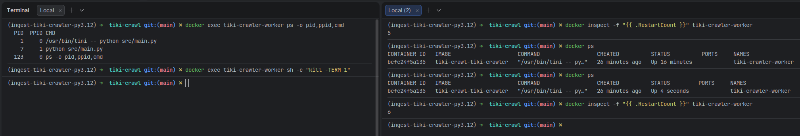

Auto-restart

## Ideas

Use "some ways" to automatically resume the crawler when system or the program crashes during execution.
### PID

```txt
PID = Process ID
- Each running process in Linux has 1 unique PID.
- Ex: python script has PID = 12345
- Process stops/crashes -> PID 12345 is gone.
```

## Technical solutions

### Option 1: Manage PID (OS Level)
Traditional approach.
```txt
1. When process starts → write PID to a file (e.g. crawler.pid)
2. Monitor -> Read PID from file.
3. Check frequently if that PID is still active.
4. If not → Trigger restart command.
```

Implementation:

- systemd: automated PID Linux services
- cron + script: manual PID check

### Option 2: Track Docker Container PID (Container Level)

```txt
1. Docker Daemon = the supervisor.
2. It monitors PID inside the container.
3. If PID 1 exits, Daemon detects.
4. Docker applies "restart ơolicy"to restart container.
```

Implementation: Docker & Docker compose

Why this?
* Standard: No need to write custom monitoring scripts.
* Resilience: handles both code crashes and server reboots.
* Isolation: Restarts in a clean environment (no zombie processes from previous run). 

Notes:
- Use tini to avoid Python program run as PID 1
  - tini = ENTRYPOINT
  - "graceful shutdown"

#### Test: Simulate crash by killing PID 1

- Kill process (in container)
    ```bash
    docker exec tiki-crawler-worker sh -c "kill -TERM 1"
    ```
- Check PIDs running
    ```bash
    docker exec tiki-crawler-worker ps -o pid,ppid,cmd
    ```
  if ps not exist (not recommended)
    ```bash
    docker exec -it tiki-crawler-worker bash
    apt-get update && apt-get install -y procps
    ps -ef
    ```
- Kill process (in container)
  ```bash
  docker exec tiki-crawler-worker sh -c "kill -TERM 1"
  ```
- Count restarts
  ```bash
   docker inspect -f "{{ .RestartCount }}" tiki-crawler-worker
  ```

